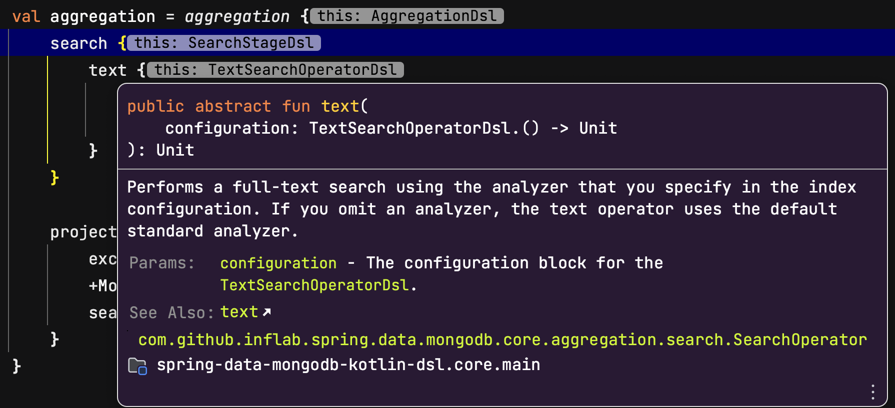

# spring-data-mongodb-kotlin-dsl

This project is a Kotlin library that provides a type-safe DSL for aggregations in Spring Data MongoDB.

## Key Features

- Type-safe DSL for building pipeline of [aggregation operations](https://www.mongodb.com/docs/manual/aggregation/)
- Support for [Atlas Search](https://docs.atlas.mongodb.com/atlas-search)
- Provide Kotlin Doc (KDoc) for all DSL functions and properties

## Requirements

- Spring Data MongoDB 3.4.0 or higher
- Java 8 or higher
- Kotlin 1.8 or higher

## Installation

> [!NOTE]  
> We do not have a publishing mechanism to a maven repository so the easiest way to add the library to your app is via a JitPack Dependency.

[](https://jitpack.io/#inflearn/spring-data-mongodb-kotlin-dsl)

- build.gradle.kts

```kotlin
repositories {
    maven { setUrl("https://jitpack.io") }
}

dependencies {
    implementation("com.github.inflearn:spring-data-mongodb-kotlin-dsl:$version")
}
```

## Why do you need this library?

### Type-safe DSL for aggregation operations

Spring Data MongoDB provides a convenient way to create [aggregation operations](https://www.mongodb.com/docs/manual/aggregation/).
With this library, you can use aggregation operations in a more concise and type-safe way.

For example, if you want to use the `$subtract` operator in the `$project` stage, 
you can write the following code using Spring Data MongoDB.

```java
Aggregation.newAggregation(
    Aggregation.project()
        .andInclude("item")
        .and(ArithmeticOperators.Subtract.valueOf("date").subtract(5 * 60 * 1000))
        .`as`("dateDifference"),
)
```

you can write the same code as follows.

```kotlin
aggregation {
    project {
        +Sales::item
        "dateDifference" expression {
            subtract {
                of(Sales::date) - (5 * 60 * 1000)
            }
        }
    }
}
```

### DSL for Atlas Search

Spring Data MongoDB does not provide a convenient way to use [Atlas Search](https://docs.atlas.mongodb.com/atlas-search).
In [official documentation](https://docs.spring.io/spring-data/mongodb/docs/current/reference/html/#mongo.aggregation.supported-aggregation-operations),
it suggests using `stage` method and passing the aggregation pipeline as a string.

```java
Aggregation.stage("""
    { $search : {
        "near": {
          "path": "released",
          "origin": { "$date": { "$numberLong": "..." } } ,
          "pivot": 7
        }
      }
    }
""");
```

This approach has the following disadvantages.

- It is not type-safe.
- It is not easy to read and maintain.
- It is easy to make a mistake in the query.

However, if you use this library, you can use Atlas Search in a type-safe way.

```kotlin
aggregation {
    search {
        near {
            path(Movies::released)
            origin(LocalDateTime.now())
            pivot(7)
        }
    }
}
```

### KDoc for all DSL functions and properties

This library provides KDoc for all DSL functions and properties.
You can easily find out what each function and property does by hovering over it in your IDE.



## Examples

This project provides `example` module that contains examples of how to use the library.
The codes used in the example are all DSL representations of the examples from the official MongoDB documentation.
Each aggregation operation is implemented as a separate repository class with `MongoTemplate` as a dependency.

For example, There is an example of `text` operation from `$search` stage
in [TextSearchRepository.kt](example/spring-data-mongodb/src/main/kotlin/com/github/inflab/example/spring/data/mongodb/repository/atlas/TextSearchRepository.kt)

```kotlin
@Repository
class TextSearchRepository(
    private val mongoTemplate: MongoTemplate,
) {

    data class TitleAndScoreDto(
        val title: String,
        val score: Double,
    )

    /**
     * @see <a href="https://www.mongodb.com/docs/atlas/atlas-search/text/#basic-example">Basic Example</a>
     */
    fun findTitleWithSufer(): AggregationResults<TitleAndScoreDto> {
        val aggregation = aggregation {
            search {
                text {
                    path(Movies::title)
                    query("surfer")
                }
            }

            project {
                excludeId()
                +Movies::title
                searchScore()
            }
        }

        return mongoTemplate.aggregate<Movies, TitleAndScoreDto>(aggregation)
    }
}
```

It is equivalent to the following MongoDB query
from [the official documentation](https://www.mongodb.com/docs/atlas/atlas-search/text/#basic-example).

```javascript
db.movies.aggregate([
    {
        $search: {
            "text": {
                "path": "title",
                "query": "surfer"
            }
        }
    },
    {
        $project: {
            "_id": 0,
            "title": 1,
            score: {$meta: "searchScore"}
        }
    }
])
```

### Running tests from examples

Each example repository contains a test code that verifies that the query is executed correctly.
There are two types of tests: one that requires a MongoDB Community instance and another that requires MongoDB Atlas.

- MongoDB Community

The repositories that are **not under** the `com.github.inflab.example.spring.data.mongodb.repository.atlas` package requires a MongoDB Community instance.
To run the MongoDB Community instance, we use [Testcontainers](https://www.testcontainers.org/).
Therefore, you need to install and run Docker on your machine.

- MongoDB Atlas

The repositories that are under the `com.github.inflab.example.spring.data.mongodb.repository.atlas` package requires a MongoDB Atlas instance.
You need to [create a MongoDB Atlas instance](https://www.mongodb.com/docs/atlas/getting-started) and set the connection information in the `application.yml` file.

> [!NOTE]
> you can create the `application.yml` file by copying `example/spring-data-mongodb/src/test/resources/application.sample.yml` file.

```yaml
spring:
  data:
    mongodb:
      username: "username"
      password: "password"
      host: "host"
```

You should refer to [the following manual](https://www.mongodb.com/docs/atlas/sample-data/) to configure sample data as well.
Because most example codes are provided based on the sample data.
If test codes are using `Atlas Search`, you also need to create a suitable search index.
Please refer to each documentation of the example code for more information.

## Contributors

<a href="https://github.com/inflearn/spring-data-mongodb-kotlin-dsl/graphs/contributors">
  
</a>

## License

This project is licensed under the MIT License - see the [LICENSE](LICENSE) file for details
